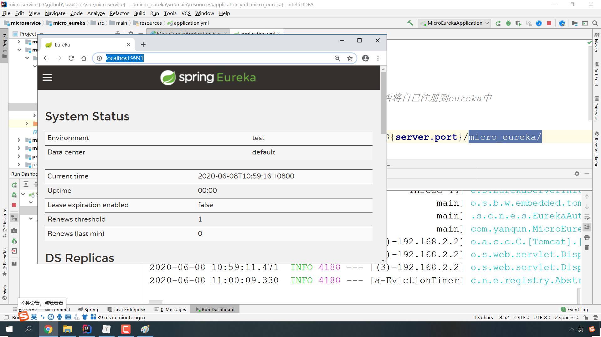
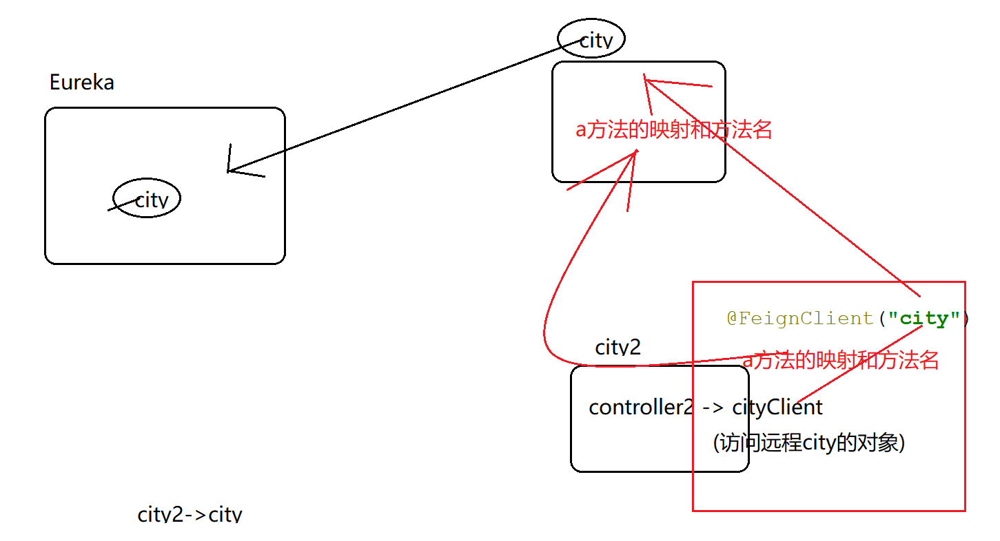

# Spring Cloud

1.本身比较靠后。 web  ssm spring boot

2.Spring Cloud自身不稳定（a.部分组件停止更新 ；b.其他技术竞争非常厉害）


本次学习版本：官方原生的Spring Cloud，原因如下：

1.标准： Servlet   struts1  struts2  springmvc 

2.更新迭代，需要大量时间。Spring Cloud，目前企业的主流。

3.技术本身不是最重要， 重要的是思想。

4.哪个是最新的？ Eureka :zookeeper   nacos    consul 


## Spring Cloud内容

spring boot：微服务构建框架

spring cloud:微服务治理框架


Spring Cloud包含了一系列技术： 

服务注册与发现：Eureka

熔断器（服务熔断）：Hystrix 

服务调用：Fegin/Ribbon

服务网关:Zuul

消息总线:Bus

分布式配置:Config 


### 搭建环境

版本问题：spring boot - spring cloud 

将spring cloud依赖 引入父工程

```xml
               <!-- 引入spring cloud-->
             <dependency>
                 <groupId>org.springframework.cloud</groupId>
                 <artifactId>spring-cloud-dependencies</artifactId>
                 <version>Greenwich.RELEASE</version>
                 <type>pom</type>
                 <scope>import</scope>
             </dependency>
```


引入Eureka环境


新建 子工程：eureka服务

引入依赖

```xml
        <dependency>
            <groupId>org.springframework.cloud</groupId>
            <artifactId>spring-cloud-starter-netflix-eureka-server</artifactId>
        </dependency>


```

配置文件

application.yml

```xml
server:
  port: 9991
eureka:
  client:
    register-with-eureka: false  #是否将自己注册到eureka中
    fetch-registry: false
    service-url:
      defaultZone: http://localhost:${server.port}/micro_eureka/

```


编写代码

```java
@EnableEurekaServer//启动eureka服务
@SpringBootApplication
public class MicroEurekaApplication {

    public static void main(String[] args) {
        SpringApplication.run(MicroEurekaApplication.class, args);
    }

}

```

访问

http://localhost:9991/




1.引入依赖

要将micro_city/micro_city2放入 eureka注册中心

```xml
       <dependency>
            <groupId>org.springframework.cloud</groupId>
            <artifactId>spring-cloud-starter-netflix-eureka-server</artifactId>
        </dependency>
```


2.配置文件


```xml
eureka:
  client:
    service-url:
      defaultZone: http://localhost:9991/eureka/
```


3.编写代码

给要加入Eureka的项目增加一个注册  

@EnableEurekaClient


测试：

先启动服务

再启动客户端


说明：可能存在一种现象，我们编写的xml/yml等配置文件，在运行时不会被放入classes文件。解决方案：

通过mvn强行打入classes。

```xml
  <build>
        <resources>
            <resource>
                <directory>src/main</directory>
                <includes>
                    <include>**/*.xml</include>
                    <include>**/*.yml</include>
                </includes>
                <filtering>false</filtering>

            </resource>


        </resources>
    </build>
```


多个微服之间 的相互访问。Feign

micro_city2  -> micro_city

操作：micro_city2

1.依赖

```xml
    <dependency>
        <groupId>org.springframework.cloud</groupId>
        <artifactId>spring-cloud-starter-openfeign</artifactId>
    </dependency>
```


2.配置

spring boot/cloud底层已经配置过了，省略

3.编码

```
@EnableDiscoveryClient
@EnableFeignClients
```


city2  ->CityClient    -> city（queryCityBiId）


为了简化代码，暂时注释掉city中的dao访问。



city2 ->controller - > cityClient ->    city的controller->     city